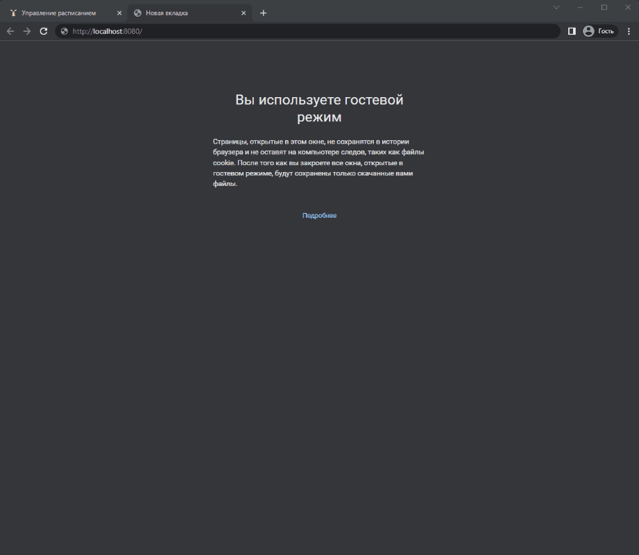
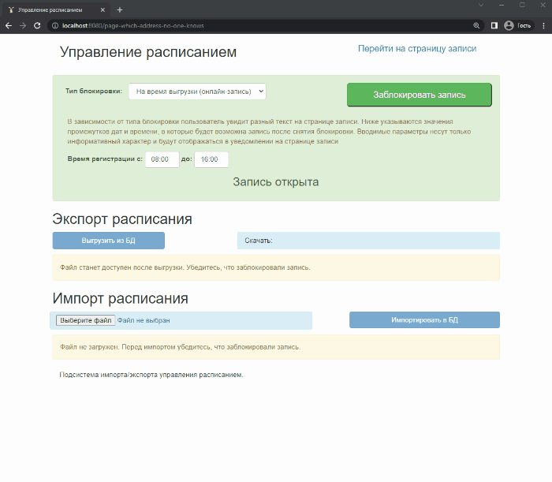
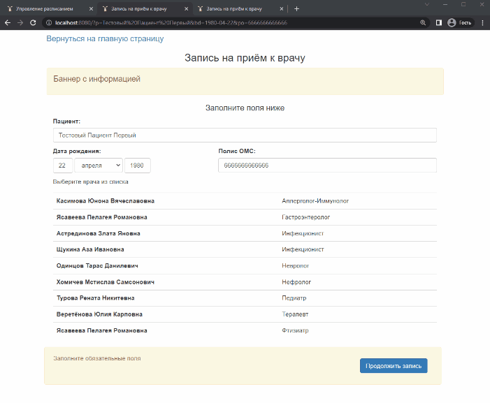

# Doctor-s-appointment

## Description

A small service for my city's outpatient clinic to make an appointment with a doctor.
It was implemented by me in 2016

This service allows patients to choose a session to make an appointment with a doctor. All changes in sessions are recorded in the outpatient clinic database.
The schedule is stored in the clinic's subsystem in a specific html format. For this reason, parsing of the schedule from this subsystem to the PostgreSQL database and back was implemented.

### Tools and libraries:

- **Backend**:  `Node.js`, for database management - `PostgreSQL` (via `pg` and `pgtools` packages)
- **Frontend**: `jQuery` v1.11.1, `Bootstrap` v3.3.6, `HTML`

## Structure of project
- `app.js` - server application
- `views/` - html content
  - `enroll.html` - content appointment page, when the appointment is open 
  - `block.html` - content appointment page, when the appointment is blocked  
  - `print.html` - print the content with information after the patient made an appointment
  - `page-which-address-no-one-knows.html` - management page
- `views/js/` - client-side scripts 
  - `ap-enroll.js` - the logic of the appointment page
  - `ap-import-export.js.js` - the logic of the management page 
- `data/` - directory for imported and exported schedule data in the clinic's subsystem html format 

## Demos
Some demonstrations of the application are shown as animations in `demos/` directory
All names are fake.

### 1. The process of making an appointment with a doctor

### 2. Management: blocking appointment page, import/export 

### 3. Handling conflicts

